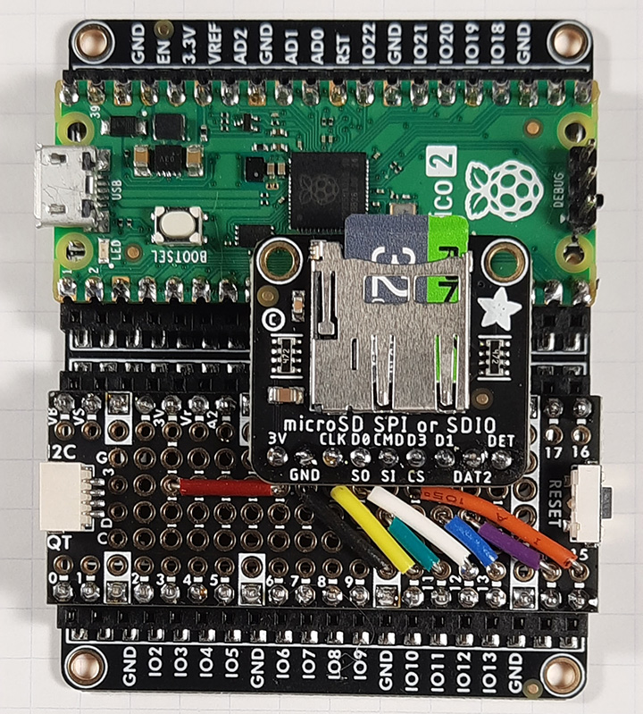

### Warning: This version has major internal changes.
SdFat version 2.3.1 corrects handling of the exFAT fields validLength
and dataLength.

In exFAT, validLength represents how far user data has been written and
dataLength represents the total space allocated to the file.

These two fields are equal unless space has been preallocated. In the past, I
returned EOF when a read hit validLength and didn't allow seek beyond 
validLength.  This does not conform to the exFat specification here:

https://learn.microsoft.com/en-us/windows/win32/fileio/exfat-specification

Now read will return zeroes beyond validLength and EOF at dataLength.  If a
file is positioned beyond validLength, write will fill the area between
validLength and the current position with zeroes and then write user data.

If you are preallocating space with the preAllocate() call, you should remove
unused space with the truncate() call so applications do not read zeroes
beyond validLength.

Support has been added for the SDIO on RP2350B QFN-80 with 48 GPIO pins.
Each PIO block is still limited to 32 GPIOs at a time, but GPIOBASE
selects which 32. 

GPIOBASE can only have value of zero or 16 so all SDIO pins must be in the 
range 0-31 or 16-47.

Run the Rp2040SdioSetup example to try RP2040/RP2350 SDIO.

This example requires a SDIO Card socket with the following six lines.

* CLK - A clock signal sent to the card by the MCU.
* CMD - A bidirectional line for for commands and responses.
* DAT[0:3] - Four bidirectional lines for data transfer.

CLK and CMD can be connected to any GPIO pins. DAT[0:3] can be connected
to any four consecutive GPIO pins in the order DAT0, DAT1, DAT2, DAT3.

Here is an example of SDIO for Pico using an Adafruit socket, PiCowbell
Proto and PiCowbell Proto Doubler.



This Socket supports SDIO with:
```
#define RP_CLK_GPIO 10
#define RP_CMD_GPIO 11
#define RP_DAT0_GPIO 12  // DAT1: GPIO13 DAT2: GPIO14, DAT3: GPIO15.
```
It also can be used on SPI1 with:
```
const uint8_t SD_CS_PIN = 15;
#define SD_CONFIG SdSpiConfig(SD_CS_PIN, DEDICATED_SPI, SPI_CLOCK, &SPI1)

  // In setup
  SPI1.setSCK(10);
  SPI1.setTX(11);
  SPI1.setRX(12);
```

This setup gets the following result in the bench example using SDIO.

<pre>
FILE_SIZE_MB = 5
BUF_SIZE = 512 bytes
Starting write test, please wait.

write speed and latency
speed,max,min,avg
KB/Sec,usec,usec,usec
15014.05,1165,32,32
15289.54,1249,32,32

Starting read test, please wait.

read speed and latency
speed,max,min,avg
KB/Sec,usec,usec,usec
15624.00,58,32,32
15624.00,51,32,32
</pre>


File copy constructors and file assignment operators have been made private by
default in 2.2.3 to prevent call by value and multiple copies of file instances.

SdFatConfig.h has options to make file constructors and assignment operators
public.

UTF-8 encoded filenames are supported in v2.1.0 or later.

Try the UnicodeFilenames example.  Here is output from ls:
<pre>
Type any character to begin
ls:
         0 😀/
          20 россиянин
          17 très élégant
           9 狗.txt
</pre>

SdFat Version 2 supports FAT16/FAT32 and exFAT SD cards. It is mostly
backward compatible with SdFat Version 1 for FAT16/FAT32 cards.

exFAT supports files larger than 4GB so files sizes and positions are
type uint64_t for classes that support exFAT.

exFAT has many features not available in FAT16/FAT32.  exFAT has excellent
support for contiguous files on flash devices and supports preallocation.

If the SD card is the only SPI device, use dedicated SPI mode. This can
greatly improve performance. See the bench example.

Here is write performance for an old, 2011, card on a Due board.
```
Shared SPI:
write speed and latency
speed,max,min,avg
KB/Sec,usec,usec,usec
294.45,24944,1398,1737

Dedicated SPI:
write speed and latency
speed,max,min,avg
KB/Sec,usec,usec,usec
3965.11,16733,110,127
```
The default version of SdFatConfig.h enables support for dedicated SPI and
optimized access to contiguous files.  This makes SdFat Version 2 slightly
larger than Version 1.  If these features are disabled, Version 2 is smaller
than Version 1.

The types for the classes SdFat and File are defined in SdFatConfig.h.
The default version of SdFatConfig.h defines SdFat to only support FAT16/FAT32.
SdFat and File are defined in terms of more basic classes by typedefs.  You
can use these basic classes in applications.

Support for exFAT requires a substantial amount of flash.  Here are sizes on
an UNO for a simple program that opens a file, prints one line, and closes
the file.
```
FAT16/FAT32 only: 9780 bytes flash, 875 bytes SRAM.

exFAT only: 13830 bytes flash, 938 bytes SRAM.

FAT16/FAT32/exFAT: 19326 bytes flash, 928 bytes SRAM.
```
The section below of SdFatConfig.h has been edited to uses FAT16/FAT32 for
small AVR boards and FAT16/FAT32/exFAT for all other boards.
```
/**
 * File types for SdFat, File, SdFile, SdBaseFile, fstream,
 * ifstream, and ofstream.
 *
 * Set SDFAT_FILE_TYPE to:
 *
 * 1 for FAT16/FAT32, 2 for exFAT, 3 for FAT16/FAT32 and exFAT.
 */
#if defined(__AVR__) && FLASHEND < 0X8000
// FAT16/FAT32 for 32K AVR boards.
#define SDFAT_FILE_TYPE 1
#else  // defined(__AVR__) && FLASHEND < 0X8000
// FAT16/FAT32 and exFAT for all other boards.
#define SDFAT_FILE_TYPE 3
#endif  // defined(__AVR__) && FLASHEND < 0X8000
```
The SdBaseFile class has no Arduino Stream or Print support.

The File class is derived from Stream and SdBaseFile.

The SdFile class is derived from SdBaseFile and Print.

Please try the examples.  Start with SdInfo, bench, and ExFatLogger.

To use SdFat Version 2, unzip the download file, rename the library folder
SdFat and place the SdFat folder into the libraries sub-folder in your main
sketch folder.

For more information see the Manual installation section of this guide:

http://arduino.cc/en/Guide/Libraries

A number of configuration options can be set by editing SdFatConfig.h
define macros.  See the html documentation File tab for details.

Please read the html documentation for this library in SdFat/doc/SdFat.html.
Start with the  Main Page.  Next go to the Classes tab and read the
documentation for the classes SdFat32, SdExFat, SdFs, File32, ExFile, FsFile.

The SdFat and File classes are defined in terms of the above classes by
typedefs. Edit SdFatConfig.h to select class options.

Please continue by reading the html documentation in the SdFat/doc folder.
